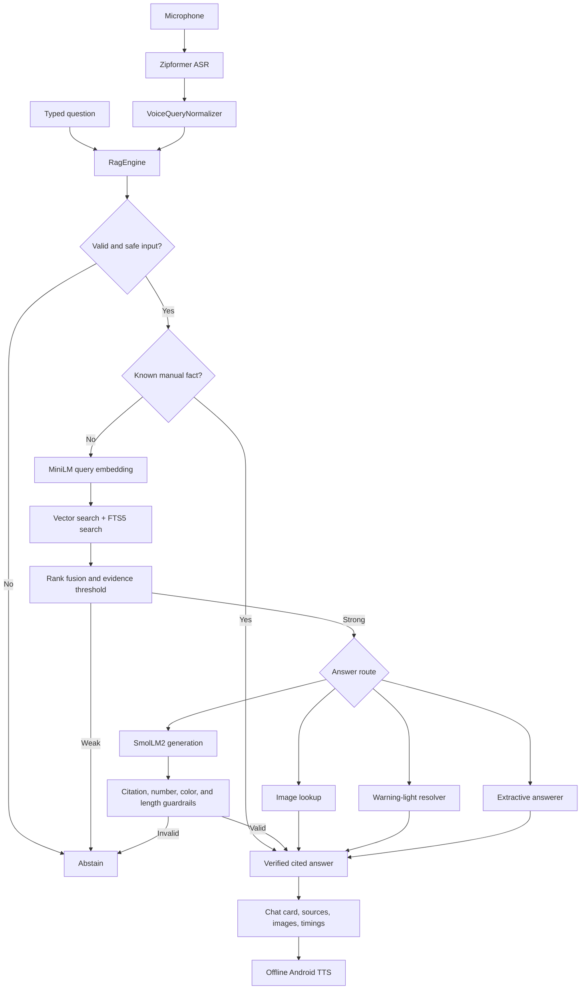

# Atlas Manual Assistant

Atlas Manual Assistant is a privacy-first Android application that answers questions about the bundled 2019 Volkswagen Atlas 3.6 L owner's manual. Text search, semantic retrieval, answer generation, speech recognition, text-to-speech, citations, and manual-image display all run on the device. The app does not request internet permission and does not use a cloud fallback.

> The repository contains large models and a manual-derived dataset. Read [Licensing and redistribution](#licensing-and-redistribution) before making it public.

## What the app does

- Accepts typed or offline voice questions.
- Corrects a small, conservative set of speech-recognition errors in automotive context.
- Searches manual chunks with both MiniLM embeddings and SQLite FTS5.
- Answers direct known facts, warning-light questions, procedural questions, and image requests through specialized routes.
- Uses a local SmolLM2 model only when deterministic routes cannot produce an answer.
- Requires page citations and rejects unsupported generated numbers or colors.
- Shows the exact source excerpts and relevant manual illustrations.
- Reads answers aloud with an installed offline English Android TTS voice.
- Reports timing for each RAG stage.

The application is intentionally narrow: it answers from one bundled manual and abstains when evidence is weak.

## Screens and user flow

The app has one programmatically constructed chat screen:

1. At startup, two background executors initialize the manual/RAG pipeline and the Zipformer speech recognizer independently.
2. The composer becomes available when the manual database is ready. The microphone also requires the speech recognizer and Android microphone permission.
3. A typed question is submitted directly. A voice question is captured as 16 kHz mono PCM, decoded locally, normalized conservatively, and submitted automatically.
4. The RAG engine retrieves and validates evidence, then chooses the safest answer route.
5. The response card displays the answer, optional images, expandable source excerpts, and detailed timings.
6. If an offline English TTS voice exists, the answer is spoken.
7. On activity destruction, pending work is stopped and audio, TTS, SQLite, ONNX Runtime, and llama.cpp resources are closed.



## Architecture

The project uses a deliberately small layered design without a dependency-injection framework.

### Presentation and Android lifecycle

`MainActivity` owns the single-screen UI, permission handling, task state, and Android lifecycle resources. The UI is built with standard Android views in Java rather than XML layouts or Compose. A single-threaded `worker` serializes RAG requests, while `voiceWorker` initializes and runs speech recognition. UI updates are marshalled back to the main thread and ignored after destruction.

This approach keeps the binary and dependency graph small, but it also concentrates view construction and orchestration in one activity. If the product grows to multiple screens or needs configuration-change state restoration, extracting a view model and dedicated renderer would become worthwhile.

### Application pipeline

`RagEngine` is the orchestration boundary. It owns `ManualRepository`, lazily initializes the embedder and LLM, records timings, and routes each question:

1. trim and screen the input for obvious prompt-injection phrases;
2. try deterministic manual facts;
3. normalize the query and create a 384-dimensional MiniLM embedding;
4. run hybrid retrieval;
5. reject weak evidence;
6. handle explicit image requests;
7. try the warning-light resolver;
8. try extractive sentence selection;
9. fall back to local constrained generation;
10. validate the generated answer before returning it.

`ChatAnswer` is the result passed to the UI. It contains answer text, source chunks, images, an abstention reason, and `RagTimings`.

### Retrieval and data

`ManualRepository` opens the copied database read-only and validates these required tables:

| Table | Purpose |
| --- | --- |
| `MANUALS` | Manual identity and version metadata |
| `MANUAL_PAGES` | Page records and page numbers |
| `MANUAL_CHUNKS` | Sectioned text chunks and 384-float embeddings |
| `MANUAL_CHUNKS_FTS` | FTS5 lexical index |
| `MANUAL_IMAGES` | Full image, thumbnail, caption, and page metadata |

The repository asks the native `atlas-sqlite` library for up to 36 semantic candidates and 36 lexical candidates. The semantic path uses sqlite-vec cosine distance; the lexical path uses FTS5/BM25. Candidate IDs are fused with reciprocal-rank-style weights:

- vector contribution: `0.58 / (60 + vectorRank)`;
- lexical contribution: `0.42 / (60 + lexicalRank)`;
- a bonus when both retrievers found the chunk;
- lexical term-coverage and adjacent-term bonuses.

Results are sorted, limited to two chunks per page, and capped at six. Evidence is considered strong only when at least one result appears in both rankings, has cosine distance at most `0.60`, and has fused score at least `0.0165`.

Short chunks may include the following chunk from the same page. Image lookup checks exact result pages plus adjacent pages and ranks captions by query-term overlap.

### Embeddings

`LocalEmbedder` runs an int8 MiniLM ONNX model through ONNX Runtime:

- `WordPieceTokenizer` loads the bundled vocabulary and performs basic Unicode tokenization and greedy WordPiece splitting.
- Input is padded or truncated to 256 tokens.
- The final hidden state is attention-mask mean-pooled.
- The 384-dimensional vector is L2-normalized for cosine search.

The model is installed from assets into `noBackupFilesDir` because native runtimes need a normal filesystem path. `AssetInstaller` uses an atomic `.part` copy and validates the expected byte count.

### Deterministic answer routes

Specialized routes reduce dependence on generative behavior:

- `ManualRepository.lookupFact` handles manual year and engine displacement from database evidence.
- `WarningLightResolver` requires a specific warning section, a color/state statement, and a supported action.
- `ExtractiveAnswerer` selects up to three high-overlap manual sentences and cites each source page.
- Explicit image questions return a matched manual illustration rather than asking the LLM to describe it.

These routes are easier to audit and generally faster than local generation.

### Local generation and guardrails

`LlamaBridge` lazily copies and loads the SmolLM2 GGUF model through `InferenceEngineImpl` and the `ai-chat` JNI library. llama.cpp runs a 1,024-token context, a 128-token batch, four CPU threads, low-temperature sampling, and a maximum of 96 generated tokens for an answer.

The system prompt requires short, cited, evidence-only answers. `AnswerGuardrails` then rejects:

- blank answers and explicit abstentions from the model;
- answers longer than 220 words;
- missing citations or citations to pages outside the retrieved set;
- numbers absent from all retrieved evidence;
- color claims not present in the evidence for the cited page.

The guardrails are intentionally conservative. They reduce, but cannot mathematically eliminate, hallucination.

### Voice input and speech output

`ZipformerVoiceInput` wraps sherpa-onnx:

- audio source: Android `MIC`;
- format: 16 kHz, mono, signed 16-bit PCM;
- capture chunks: 1,600 samples;
- maximum recording: 30 seconds;
- decoder: modified beam search with four active paths;
- moderate automotive hotword score: `1.3`;
- endpoint detection is disabled because the user explicitly taps Stop.

Capture and decoding are decoupled by a bounded queue. A sentinel guarantees that stopping cannot deadlock even if decoding falls behind.

`VoiceQueryNormalizer` is used only for microphone transcripts. It applies a few contextual phonetic substitutions and a bounded Damerau-Levenshtein match against automotive terms. Typed input is never rewritten.

Speech output uses Android `TextToSpeech` and selects an installed, non-network English voice, preferring US English.

### Native layer

There are two JNI libraries:

| Library | Source | Responsibility |
| --- | --- | --- |
| `atlas-sqlite` | `vector_sqlite.cpp`, SQLite, sqlite-vec | Read-only cosine and FTS5 searches |
| `ai-chat` | `ai_chat.cpp`, llama.cpp | GGUF loading, prompt decoding, sampling, and cleanup |

Only `arm64-v8a` is built. CMake statically compiles the SQLite amalgamation and sqlite-vec into `atlas-sqlite`; llama.cpp is built as a native subproject.

## Important architectural decisions

### Fully offline execution

**Decision:** bundle every model, index, image, and runtime.

**Why:** questions, microphone audio, retrieved content, and answers never need to leave the device. The app works without connectivity and has predictable per-query cost.

**Trade-off:** the repository and APK are very large, startup/model-load time is device-dependent, model updates require shipping a new app, and only capable 64-bit ARM devices are supported.

### Hybrid retrieval instead of vector-only search

**Decision:** combine semantic similarity with FTS5.

**Why:** embeddings handle paraphrases, while lexical matching is stronger for exact control names, warning labels, page terminology, and rare tokens. Requiring agreement between both paths makes abstention safer.

**Trade-off:** rank weights and thresholds are hand-tuned constants. They should eventually be calibrated against a versioned evaluation set.

### Deterministic routes before the LLM

**Decision:** facts, warning lights, extractive procedures, and images bypass generation when possible.

**Why:** deterministic answers are faster, inspectable, and less likely to invent safety-critical details.

**Trade-off:** route-specific code adds domain rules and can miss paraphrases not represented in its patterns.

### SQLite as the retrieval store

**Decision:** ship one database containing metadata, text, FTS, embeddings, and image references.

**Why:** SQLite is transactional, portable, compact, easy to inspect, and already mature on Android. sqlite-vec avoids a separate vector service.

**Trade-off:** the current native implementation opens a separate read-only SQLite connection per search operation, and the database is static until a new app version is installed.

### Programmatic views and a single activity

**Decision:** use platform Android views without Compose, fragments, or an MVVM framework.

**Why:** the app has one screen, minimal state, no navigation, and benefits from a small dependency surface.

**Trade-off:** `MainActivity` combines rendering and orchestration. XML/Compose previews, reusable UI components, state restoration, and isolated UI tests are limited.

### Java plus C++ rather than Kotlin-only

**Decision:** keep Android orchestration in Java and performance-sensitive/model integrations in C++.

**Why:** JNI is necessary for the chosen native libraries, and the Java surface stays straightforward.

**Trade-off:** JNI adds crash risk, manual lifecycle management, ABI constraints, and a slower native build. The Kotlin standard library is currently transitive support for the sherpa AAR rather than the app's primary language.

## Strengths and weaknesses compared with alternatives

| Area | Current approach | Strengths | Weaknesses | Main alternative |
| --- | --- | --- | --- | --- |
| Privacy | Fully on-device | No network permission, no server retention, offline availability | Large package and device resource use | Cloud RAG is smaller and easier to update, but sends user/manual data off-device |
| Retrieval | MiniLM + FTS5 + rank fusion | Handles paraphrases and exact terms; auditable evidence threshold | Requires threshold tuning and a prebuilt index | Vector-only is simpler but weaker for exact terminology; BM25-only misses semantic matches |
| Answering | Deterministic routes, then small LLM | Fast common paths, citations, reduced hallucination | More domain rules; small LLM has limited reasoning | LLM-only is simpler to route but less reliable and slower |
| Storage | Bundled read-only SQLite | Single portable artifact; relational, FTS, and vector data together | Static content and duplicate native/platform SQLite connections | Room improves Android ergonomics but does not replace the native vector path |
| ASR | Bundled Zipformer | Private and offline, domain hotwords | Adds about 69 MB and substantial initialization cost | Android/cloud speech is easier and often more accurate, but may require a network/service |
| TTS | Installed offline Android voice | No bundled synthesis model; platform integration | Quality and availability vary by device | Bundled neural TTS is consistent but much larger and more complex |
| UI | One Java activity with platform views | Few dependencies and easy deployment | Limited testability, previews, and scalable state management | Compose/MVVM scales better but adds framework and migration cost |
| Native inference | llama.cpp on CPU | Broad GGUF support and no vendor service | JNI complexity, four fixed threads, arm64-only, slower on modest hardware | NNAPI/GPU/vendor SDK may be faster but is less portable |

## Project structure

```text
.
├── .github/workflows/android.yml       # GitHub Actions build and unit-test workflow
├── app/
│   ├── libs/                           # Local sherpa-onnx Android archive
│   ├── src/main/
│   │   ├── assets/
│   │   │   ├── asr/                    # Zipformer ASR model and vocabulary
│   │   │   ├── database/manuals.db     # Manual, chunks, FTS index, embeddings, image metadata
│   │   │   ├── manual_assets/          # Full WebP images and thumbnails
│   │   │   └── models/                 # MiniLM and SmolLM2 models
│   │   ├── cpp/                        # JNI bridges and CMake configuration
│   │   ├── java/
│   │   │   ├── com/atlas/manualassistant/
│   │   │   │   ├── MainActivity.java   # UI, permissions, executors, TTS, lifecycle
│   │   │   │   ├── RagEngine.java      # RAG orchestration and answer routing
│   │   │   │   ├── ManualRepository.java
│   │   │   │   ├── LocalEmbedder.java
│   │   │   │   ├── ZipformerVoiceInput.java
│   │   │   │   └── ...                 # Guardrails, resolvers, models, tokenizer
│   │   │   └── com/arm/aichat/internal/
│   │   │       └── InferenceEngineImpl.java
│   │   └── res/                         # Theme, colors, and user-facing strings
│   └── src/test/                        # JVM unit tests
├── vendor/
│   ├── llama.cpp/                       # Vendored native LLM runtime
│   ├── sqlite/                          # SQLite amalgamation
│   └── sqlite-vec/                      # Vector extension
├── build.gradle                         # Android Gradle Plugin version
├── settings.gradle                      # Repositories and module graph
└── gradle/wrapper/                      # Reproducible Gradle 8.9 wrapper
```

`downloads/`, IDE state, local SDK configuration, and generated build directories are intentionally ignored.

## Requirements

- Git with [Git LFS](https://git-lfs.com/)
- Android Studio or command-line Android SDK
- JDK 17
- Android SDK Platform 34
- Android NDK `27.3.13750724`
- CMake `3.22.1` or a compatible version accepted by the Android Gradle Plugin
- An arm64-v8a Android device or emulator running Android 9 (API 28) or newer
- Several gigabytes of free disk space for sources, Gradle caches, native intermediates, and APK output

The checked-in versions are Gradle `8.9`, Android Gradle Plugin `8.7.3`, compile/target SDK `34`, and Java/C++ `17`.

## Getting started

```bash
git clone <repository-url>
cd android
git lfs install
git lfs pull
```

Create `local.properties` or let Android Studio create it:

```properties
sdk.dir=/absolute/path/to/Android/sdk
```

The NDK version is declared in `app/build.gradle`; installing it through SDK Manager is sufficient.

Build and test:

```bash
./gradlew testDebugUnitTest lintDebug assembleDebug
```

Install on a connected arm64 device:

```bash
adb install -r app/build/outputs/apk/debug/app-debug.apk
```

The first start copies filesystem-backed models and the database into the app's no-backup directory. The LLM itself is loaded lazily only when a question reaches the generative fallback.

## Verification

The repository currently includes JVM tests for:

- detailed RAG timing formatting;
- contextual ASR correction;
- unambiguous automotive typo correction;
- preservation of ordinary non-automotive speech;
- preservation of already-correct transcripts.

Recommended checks before a release:

```bash
./gradlew testDebugUnitTest
./gradlew assembleDebug
./gradlew assembleRelease
```

On a physical device, verify:

1. typed queries and source expansion;
2. first-run database/model copying;
3. manual fact, warning-light, procedural, image, generation, and abstention routes;
4. microphone permission denial and approval;
5. start/stop voice capture and the 30-second cutoff;
6. offline operation with airplane mode enabled;
7. TTS behavior with and without an offline English voice;
8. repeated activity creation/destruction and memory use.

There is no versioned retrieval-quality or instrumentation test suite yet. That is the largest test gap.

## Configuration and tuning

Important constants are intentionally close to the code that uses them:

- retrieval candidate counts, fusion thresholds, and evidence thresholds: `ManualRepository`;
- prompt, visual routing, and context excerpt budget: `RagEngine`;
- embedding dimension and token limit: `LocalEmbedder`;
- LLM context, batch size, threads, and temperature: `ai_chat.cpp`;
- recording duration, chunk size, beam paths, and hotword score: `ZipformerVoiceInput`.

Treat changes to retrieval thresholds, prompts, token budgets, or ASR hotwords as behavior changes. Evaluate them against representative questions, including deliberately unanswerable and safety-sensitive cases.

Expected asset byte sizes are checked in `AssetInstaller` callers. When replacing a model or database, update the corresponding constant or installation will fail by design.

## Privacy and security

- The manifest requests only `RECORD_AUDIO`; it has no internet permission.
- The database is opened read-only.
- Model and database assets are copied to `noBackupFilesDir`.
- Android backup is disabled.
- Prompt-injection phrases are screened before retrieval.
- Generated citations, numeric claims, and color claims are checked against retrieved evidence.
- Release minification and resource shrinking are enabled.

Limitations:

- This is an informational manual assistant, not a substitute for the vehicle's warning indicators, professional service, or safety instructions.
- Pattern-based injection detection is not a complete security boundary.
- JNI and native model parsers process large binary assets; only trusted, verified artifacts should be bundled.
- Release currently uses the debug signing configuration. Configure a protected production keystore outside version control before distributing an APK.
- The app currently logs retrieval metadata in Android logs. It does not intentionally log full user questions or answers, but release logging should still be reviewed before production.

## Performance and package size

The main bundled artifacts are approximately:

- SmolLM2 GGUF: 256 MB;
- Zipformer ASR assets: 69 MB;
- sherpa-onnx AAR: 54 MB;
- MiniLM ONNX model and vocabulary: 22 MB;
- manual database: 11 MB;
- manual images and thumbnails: 4 MB;
- llama.cpp, SQLite, and sqlite-vec native code built for arm64.

Actual APK size, memory usage, and latency depend on Gradle packaging, device CPU, storage, and Android's runtime extraction behavior. The fixed four-thread llama.cpp configuration favors predictability over device-adaptive tuning.

## Known limitations and future improvements

- Add a versioned evaluation corpus with answerability, retrieval recall, citation correctness, and latency metrics.
- Add repository, guardrail, tokenizer, and answer-router unit tests using a small fixture database.
- Add Android instrumentation tests for permissions, lifecycle, audio stop behavior, and source/image rendering.
- Separate UI state/rendering from `MainActivity` if screens or configuration-change requirements grow.
- Replace debug release signing with CI-managed production signing.
- Decide whether native SQLite connections should be pooled instead of opened per vector/FTS request.
- Evaluate adaptive CPU thread counts and hardware acceleration on representative devices.
- Add integrity hashes or signatures for model/database assets in addition to byte-size checks.
- Establish an update strategy for manual/model content without weakening offline guarantees.
- Complete license attribution and provenance for every binary and content asset.

## GitHub repository notes

Large binary types are tracked with Git LFS through `.gitattributes`. The included GitHub Actions workflow checks out LFS content, validates the wrapper, installs the pinned native toolchain, runs unit tests, and assembles a debug APK.

Before the first push:

```bash
git init
git lfs install
git add .gitattributes
git lfs track
git add .
git status
```

Confirm that large files are LFS pointers:

```bash
git lfs ls-files
```

Do not commit `local.properties`, signing keys, `.idea`, build output, downloads, or generated APKs.

## Licensing and redistribution

No project-wide license has been selected in this snapshot. The source tree also contains third-party native code, models, a binary AAR, and manual-derived text/images with separate terms. Review [THIRD_PARTY_NOTICES.md](THIRD_PARTY_NOTICES.md), verify provenance and redistribution permission, add all required notices, and choose a root license before making the repository public or distributing an APK.

See [CONTRIBUTING.md](CONTRIBUTING.md) for development expectations and [SECURITY.md](SECURITY.md) for vulnerability reporting guidance.
